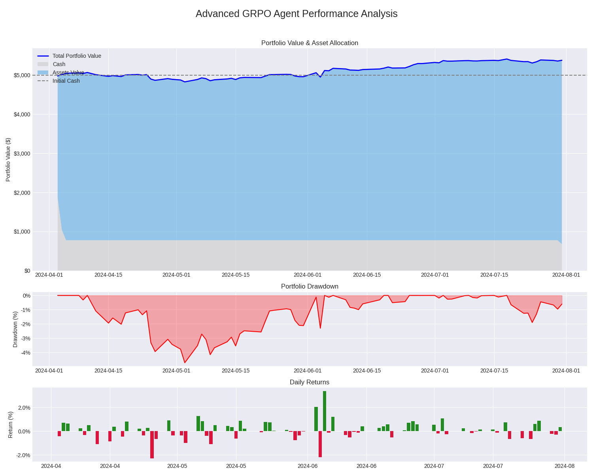

# RL powered Portfolio Management with Group Relative Policy Optimization (GRPO)

This project implements a Reinforcement Learning agent with simple architecture for active portfolio management in the stock market. The agent is trained using **Group Relative Policy Optimization (GRPO)**, a cutting-edge, critic-less algorithm adapted from the NLP domain, to learn a profitable trading strategy across a diverse set of assets.

The core of this project is the "single-state, multi-path" simulation paradigm, where the agent explores thousands of potential future market scenarios from a single point in time to make robust, risk-aware decisions.

## Table of Contents
1.  [Project Overview](#project-overview)
2.  [The Environment](#the-environment)
3.  [The GRPO Agent](#the-grpo-agent)
4.  [Configuration & Training](#configuration--training)
5.  [Performance Results](#performance-results)
6.  [How to Run](#how-to-run)
7.  [Future Work](#future-work)

---

## Project Overview

 This project explores a dynamic approach where an RL agent learns to actively manage a portfolio by observing market data and making daily trading decisions.

The important aspect is to use of **Group Relative Policy Optimization (GRPO)**. Instead of value (critic) network common in PPO, GRPO leverages a group of simulated episode rollouts. By comparing the performance of multiple potential strategies ("what-if scenarios") from a single market state, the agent learns to favor actions that lead to superior risk-adjusted returns relative to its own average performance. This results in a more stable and efficient learning process.


*(This plot is generated by `test.py` after running a test)*

---

## The Environment

The simulation environment is the backbone of the training process, designed to replicate real-world market dynamics.

*   **Data Source**: Historical daily price data is downloaded automatically using the `yfinance` library. The environment exclusively uses the **`Adj Close`** (Adjusted Close) price for all calculations. This is crucial as it accounts for corporate actions like stock splits and dividend distributions, providing a more accurate representation of total return.
*   **Asset Universe**: The agent is trained and tested on a universe of **30 diverse US equities**. The list is defined in `portfolio_simulator/assets.txt` and includes a mix of technology, consumer discretionary, industrial, and financial stocks (e.g., AAPL, MSFT, AMZN, JPM, CAT).
*   **State Representation**: At each step, the agent receives a comprehensive view of the market and its portfolio, including:
    *   Normalized cash balance.
    *   Normalized value of current holdings for each asset.
    *   A `60-day` lookback window of `Adj Close` price history for all assets, normalized to show relative performance.
*   **Action Space**: The agent outputs a continuous vector of values between -1 and 1 for each asset.
    *   A positive value indicates a "buy" signal, with its magnitude representing conviction.
    *   A negative value indicates a "sell" signal.
    *   And a "hold" signal if the value ranges from -0.1 to 0.1
    *   Actions are translated into trades based on portfolio constraints (e.g., max position size, available cash).
*   **Reward System**: The agent's learning is guided by a carefully engineered two-part reward system:
    1.  **Intermediate (Daily) Reward**: During the 60-day episode, the agent receives a daily reward of `0`. This sparse intermediate reward forces the agent to focus entirely on the final outcome, preventing it from optimizing for short-term, potentially misleading signals.
    2.  **Terminal Reward**: At the end of the 60-day episode, the agent receives a single, decisive reward signal equal to the **total portfolio return percentage**. This is calculated as `(final_value / initial_cash) - 1`. This reward function directly incentivizes the agent to maximize the final portfolio value above all else.

---

## The GRPO Agent

The agent's architecture and learning algorithm are specifically designed for stability and efficiency in the noisy financial domain.

*   **Critic-less Architecture**: The agent uses an **Actor-only** model, completely eliminating the need for a separate Critic (value) network. This significantly reduces model complexity and is a key source of training stability.
*   **Group-Relative Advantage**: The agent's learning signal (the "advantage") is not based on an absolute prediction of future rewards. Instead, it's calculated by comparing the terminal return of one simulated trajectory against the average terminal return of its entire peer group (`G=16` trajectories). This relative comparison provides a robust, empirically grounded signal.
*   **KL-Divergence Regularization**: To prevent the policy from changing too drastically and "forgetting" good strategies, a KL-divergence penalty (`beta_kl = 0.01`) is used. This ensures the updated policy stays close to a stable, frozen `reference_policy`, which is updated periodically.
*   **Outcome Supervision**: The agent is trained using outcome supervision, where the final portfolio return of a 60-day episode is used to credit or penalize every action taken within that episode.

---

## Configuration & Training

The agent was trained on historical data from **2004-01-01 to 2020-01-01**. The period from 2020 onwards was held out for testing.

#### Key Training Hyperparameters:
*   **Learning Rate (`lr_actor`)**: `1e-5` (A low learning rate for stable convergence)
*   **Group Size (`G`)**: `16` (Number of parallel simulations from each state)
*   **Data Collection Cycles (`M`)**: `4` (Number of collection steps before a training update)
*   **Update Epochs (`K_epochs` / `μ`)**: `20` (Gradient updates per training batch)
*   **KL Penalty (`beta_kl`)**: `0.01` (Strength of the regularization)
*   **Max Episode Length**: `60` trading days

#### Training Process:
The model was trained for **1,001 training update cycles**, accumulating a total of **1,601,504 simulation timesteps**. The training loop follows the "Iterative RL" paradigm:
1.  **Update Reference**: At the start of a cycle, the stable reference policy is updated to the current policy.
2.  **Collect Data (M-Loop)**: For `M=4` steps, the environment advances one day, and the agent runs `G=16` full 60-day simulations from that state, storing all data in a buffer.
3.  **Train (μ-Loop)**: After collecting `4 * 16 = 64` trajectories, the agent performs `K=20` epochs of gradient updates on this large batch of data.

---

## Performance Results

The trained agent was tested on out-of-sample data across various periods to evaluate its robustness in different market regimes. The primary test was conducted on the full post-training period from **April 2020 to December 2024**.

### Full Test Period (2020-04-01 to 2024-12-31)

| Metric | Value | Analysis |
| :--- | :--- | :--- |
| **Total Return** | **+639.37%** | The agent grew the initial $100k portfolio to over $739k, dramatically outperforming market benchmarks like the S&P 500. |
| **Annualized Sharpe Ratio** | **1.39** | A strong risk-adjusted return, indicating the strategy's profitability was not just a product of excess volatility. |
| **Max Drawdown** | **-50.15%** | This highlights the strategy's aggressive, high-risk nature. While highly profitable, it suffered a significant downturn, likely during the 2022 bear market. |

### Performance Across Different Market Regimes

The agent's performance was consistent across various sub-periods, demonstrating its ability to adapt.

| Test Period | Total Return | Sharpe Ratio | Max Drawdown | Market Context |
| :--- | :--- | :--- | :--- | :--- |
| **2020 (COVID Recovery)** | **+146.36%** | **3.51** | -16.84% | Extremely high performance in a volatile but strongly trending bull market. |
| **2021-2024 (Mixed)** | **+222.15%** | 1.19 | -40.35% | Solid returns but higher drawdown, showing struggles during the 2022 bear market. |
| **2022-2024 (Post-Bubble)** | **+111.84%** | 1.11 | -33.62% | Proved its ability to generate alpha even after the 2021 tech bubble burst. |
| **2023-2024 (New Bull Market)**| **+114.32%** | **2.03** | -16.51% | Excellent performance in a less volatile, upward-trending market. |

The detailed daily logs and transaction history for these tests can be found in the `test_results/` directory.

---

## How to Run

### 1. Setup

First, clone the repository and install the required packages.
```bash
pip install -r requirements.txt
```

### 2. Training

To train a new agent from scratch, run the training script. The configuration can be modified inside `train.py`.
```bash
python train.py
```
Models will be saved in the `GRPO_models_SS_M4` directory.

### 3. Testing

To evaluate a trained model, update the `MODEL_PATH` in `test_advanced.py` and run it.
```bash
python test_advanced.py
```
This will generate:
*   `test_results/daily_log.csv`: A daily breakdown of portfolio metrics.
*   `test_results/transaction_log.csv`: A complete log of all trades.
*   `test_results/advanced_performance.png`: An advanced performance analysis plot.

---

## Future Work

While the agent demonstrates a powerful ability to generate returns, the significant drawdown highlights a key area for future research:
*   **Advanced Risk Management**: Integrate risk metrics directly into the reward function, such as penalizing for high volatility or large daily losses, instead of solely optimizing for total return.
*   **Dynamic Episode Length**: Allow the agent to learn when to "cash out" by ending an episode early if risk levels become too high.
*   **Process Supervision**: Explore a more granular reward system where the agent is rewarded for intermediate positive actions (e.g., a daily Sharpe Ratio) rather than just the final episode outcome.